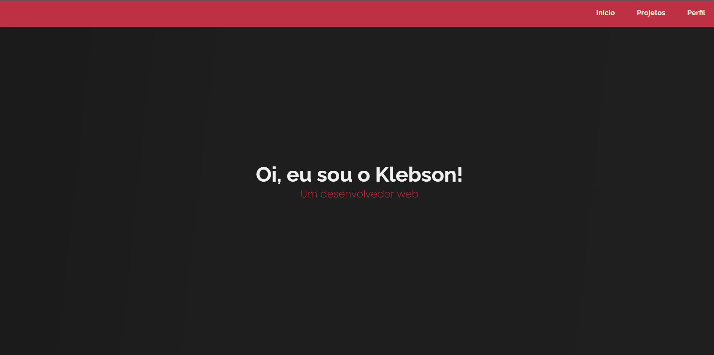

<h1 align="center"> Portfólio Pessoal</h1>

Portfólio elaborado para demonstrar projetos já feitos por mim.

  <a href="#-tecnologias">Tecnologias</a>&nbsp;&nbsp;&nbsp;|&nbsp;&nbsp;&nbsp;
  <a href="#-projetos">Projetos</a>&nbsp;&nbsp;&nbsp;|&nbsp;&nbsp;&nbsp;
  <a href="#memo-licença">Licença</a>

  

 

## 🚀 Tecnologias 

- HTML e CSS
- Git e Github 

## 💻 Projeto

A ideia do projeto era elaborar um Portfólio que mostrasse projetos já elaborados por mim, usando HTML e CSS.

- [Acesse aqui o projeto online](https://klebsonamarantes.github.io/portifolio-pessoal/)

## :memo: Licença

Esse projeto está sob a licença MIT.

